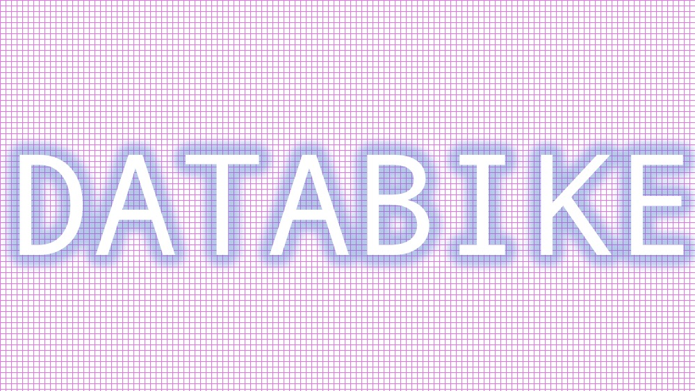
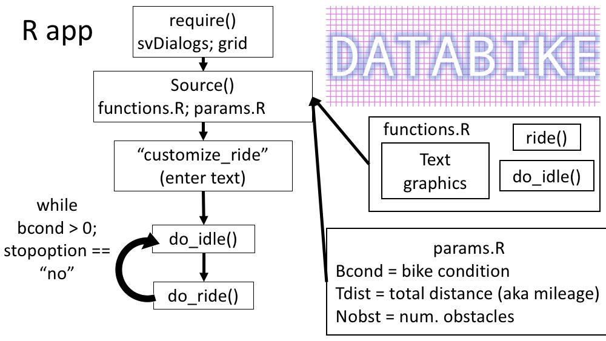
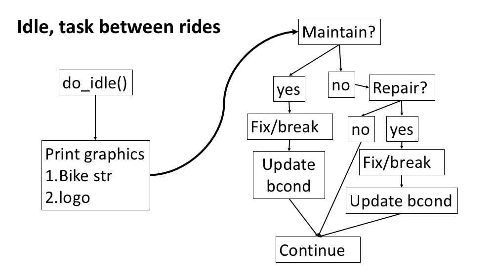
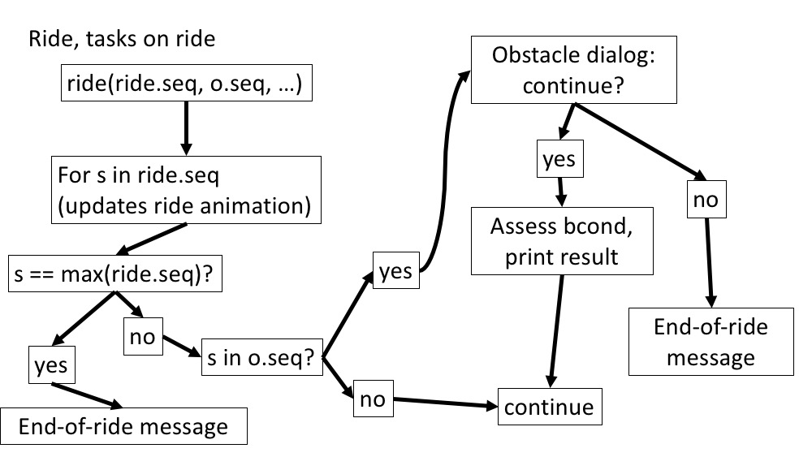

# Outline

The app data is contained in 2 main scripts, `params.R` and `functions.R`. The former consists of the main functions managing the app, and the latter defines starting parameters and user options.



## params.R

Starting using parameters include `tdist`, `bcond`, and askndaslkdn

## functions.R

### idle()



### ride()

Functions do two principle tasks: 1. manage frames for app sequence; 2. handle user options through dialogue windows.



# Running the app

Currently, the app works within a standard R package format, with the exception of `app.R`, which lives in the main directory. To run the app, either run `app.R` from an Rsession or from command line with:

```{bash, appcallcl--fixthis!!, eval = FALSE, echo = TRUE}
Rscript ./app.R
```


